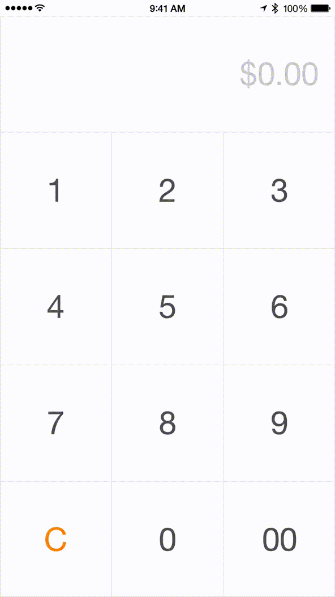

# LEAmountInputView

[](https://travis-ci.org/efremidze/LEAmountInputView)
[](http://cocoapods.org/pods/LEAmountInputView)
[](http://cocoapods.org/pods/LEAmountInputView)
[](http://cocoapods.org/pods/LEAmountInputView)

## Overview

`LEAmountInputView` is an amount input view inspired by Square's design.



## Installation

LEAmountInputView is available through [CocoaPods](http://cocoapods.org). To install
it, simply add the following line to your Podfile:

```ruby
pod "LEAmountInputView"
```

## Usage

See the `LEAmountInputViewDemo` project for example usage.

### Import

```objc
#import "LEAmountInputView.h"
```

### Example

```objectivec
LEAmountInputView *amountInputView = [[LEAmountInputView alloc] initWithFrame:self.view.frame numberStyle:NSNumberFormatterCurrencyStyle];
[self.view addSubview:amountInputView];
```

## Contributions

Contributions are totally welcome.

## License

LEAmountInputView is available under the MIT license. See the LICENSE file for more info.
